<div align="center">
  
</div>

<br/>

<div align="center">
  <a href="https://github.com/DeveshPant5">
    
  </a>
</div>

<div align="center">

[](https://github.com/DeveshPant5)
[](https://github.com/DeveshPant5)
[](https://maportt.netlify.app/)
[](https://www.linkedin.com/in/devesh-pant-887bb9256)
[](mailto:dev.deveshpant50@gmail.com)

</div>

---

## About me

I design and build products that feel fast, look premium, and actually solve something. Currently shipping SaaS at **Kumi Labs**, after a full-stack internship at Haze Media IT. B.Tech at Gautam Buddha University.

I like owning the whole slice: Flutter / React on the surface, FastAPI / Node.js underneath, PostgreSQL and MongoDB when the data model demands it.

```js
const devesh = {
  role: "Full Stack Developer",
  building: "SaaS at Kumi Labs",
  stack: ["Flutter", "React", "FastAPI", "Node.js", "PostgreSQL", "MongoDB"],
  focus: ["AI counsellors", "RAG systems", "premium UI/UX"],
  currently: "Turning messy product ideas into shippable interfaces",
  askMeAbout: ["mobile + web product engineering", "grounding LLMs with RAG"],
};
```

- Currently building SaaS products and AI-assisted product surfaces
- Learning deeper retrieval pipelines, evals, and production LLM patterns
- Open to collaboration on Flutter, React, and AI-backed full-stack work
- Fun fact: I care as much about micro-interactions as I do about API contracts

---

## Featured work

<table>
  <tr>
    <td width="50%" valign="top">
      <h3>Counselix — AI Counsellor</h3>
      <p>
        An AI-powered education counsellor that reads a student’s profile, goals, and constraints, then returns guidance that actually fits. Conversational, personal, and built to feel like a session — not a chatbot dump.
      </p>
      <p>
        <b>Stack:</b> React · Node.js · PostgreSQL · Groq · Tailwind
      </p>
      <p>
        <a href="https://maportt.netlify.app/">Live on portfolio</a>
      </p>
    </td>
    <td width="50%" valign="top">
      <h3>RAG Knowledge Engine</h3>
      <p>
        A retrieval-augmented generation pipeline that grounds counsellor answers in verified documents instead of model memory. Chunk, embed, retrieve, then generate — with FastAPI in the middle and Postgres / Mongo for durable state.
      </p>
      <p>
        <b>Stack:</b> FastAPI · embeddings · PostgreSQL · MongoDB · Node.js
      </p>
      <p>
        Retrieval first. Generation second. Hallucinations last.
      </p>
    </td>
  </tr>
  <tr>
    <td width="50%" valign="top">
      <h3>Lalit — AI Voice Assistant</h3>
      <p>
        Voice-first assistant work: intent, context, and a product loop that talks back. Part of the same AI product thread as Counselix — less dashboard, more conversation.
      </p>
      <p>
        <b>Stack:</b> Python · FastAPI · speech + LLM orchestration
      </p>
    </td>
    <td width="50%" valign="top">
      <h3>Session Booking</h3>
      <p>
        End-to-end booking product: calendar flow on the frontend, session APIs on the backend. Built as a real scheduling surface, not a form demo.
      </p>
      <p>
        <b>Stack:</b> React · TypeScript · Node.js
      </p>
      <p>
        <a href="https://github.com/DeveshPant5/sessionbookingfront">Frontend</a> ·
        <a href="https://github.com/DeveshPant5/sessionbookingback">Backend</a>
      </p>
    </td>
  </tr>
  <tr>
    <td width="50%" valign="top">
      <h3>Thrift Marketplace</h3>
      <p>
        Cross-platform thrift commerce — listings, auth, and a Flutter client talking to a Node backend. Built for people who actually buy and sell, not just scroll.
      </p>
      <p>
        <b>Stack:</b> Flutter · Node.js · MongoDB
      </p>
      <p>
        <a href="https://github.com/DeveshPant5/Thrift-app-front-end-">App</a> ·
        <a href="https://github.com/DeveshPant5/thrift-app-backend">API</a>
      </p>
    </td>
    <td width="50%" valign="top">
      <h3>Quick Commerce (B2C)</h3>
      <p>
        Blinkit-style grocery experience in Flutter: catalog, cart, and the speed-obsessed UX that quick commerce lives or dies on.
      </p>
      <p>
        <b>Stack:</b> Flutter · Dart
      </p>
      <p>
        <a href="https://github.com/DeveshPant5/internship-assignment-B2C">Repository</a>
      </p>
    </td>
  </tr>
</table>

<p align="center">
  More on GitHub:
  <a href="https://github.com/DeveshPant5/reconsys">reconsys</a> ·
  <a href="https://github.com/DeveshPant5/youtube-clone-">YouTube clone</a> ·
  <a href="https://github.com/DeveshPant5/solar-system">CSS solar system</a> ·
  <a href="https://maportt.netlify.app/">full archive on maportt</a>
</p>

---

## Tech stack

<p align="center">
  
</p>

<p align="center">

**Languages**  


**App & web**  


**APIs**  


**Data**  


</p>

---

## GitHub stats

<div align="center">
  
  
</div>

<br/>

<div align="center">
  
</div>

<br/>

<div align="center">
  
</div>

<div align="center">
  
</div>

---

## Contribution snake

<div align="center">
  <picture>
    <source media="(prefers-color-scheme: dark)" srcset="https://raw.githubusercontent.com/DeveshPant5/DeveshPant5/output/github-contribution-grid-snake-dark.svg" />
    <source media="(prefers-color-scheme: light)" srcset="https://raw.githubusercontent.com/DeveshPant5/DeveshPant5/output/github-contribution-grid-snake.svg" />
    
  </picture>
</div>

---

## Connect

<div align="center">

[](https://github.com/DeveshPant5)
[](https://www.linkedin.com/in/devesh-pant-887bb9256)
[](https://maportt.netlify.app/)
[](mailto:dev.deveshpant50@gmail.com)

</div>

<div align="center">
  
</div>

<p align="center">
  
</p>
